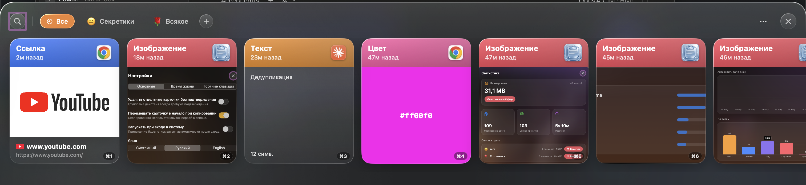
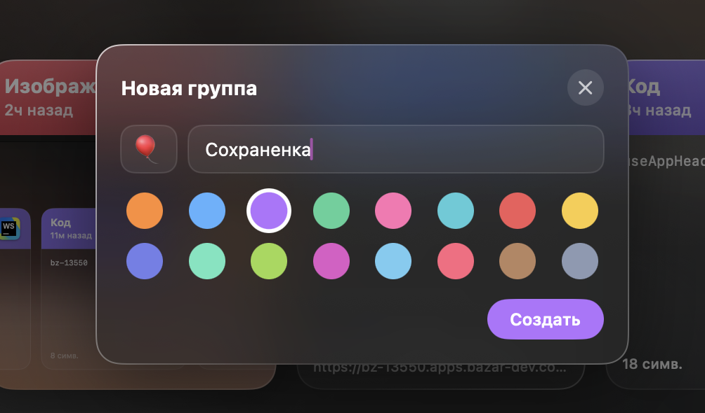
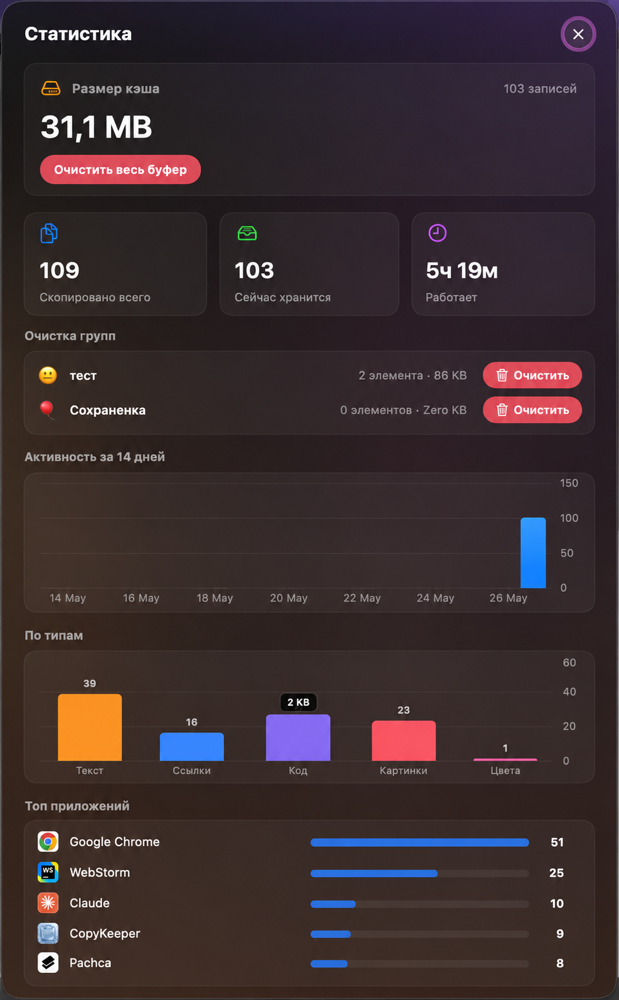

# CopyKeeper

Менеджер буфера обмена для macOS со стеклянной панелью, выезжающей снизу экрана.

## Возможности

- 📋 История буфера обмена с цветными карточками по типам: текст, ссылки, код, изображения, цвета
- 🗂 Группы с собственным цветом и эмодзи, перетаскивание карточек в группы
- 📌 Закрепление карточек: закреплённые держатся в начале списка и не удаляются по сроку хранения
- 🔎 Поиск по содержимому
- 🔗 Превью ссылок (картинка из Open Graph)
- 🎨 Распознавание цветов (HEX / RGB / HSL) с заливкой карточки
- ✏️ Переименование и редактирование карточек
- ⏱ Автоудаление по сроку хранения (от 1 часа до «никогда»)
- ⌨️ Глобальная горячая клавиша (по умолчанию ⌘⇧C) и навигация с клавиатуры
- 📊 Статистика: размер кэша, активность, распределение по типам и приложениям
- 🌐 Локализация: русский / английский (или системный язык)

## Сборка

Требуется macOS и установленный Xcode / Command Line Tools.

```bash
./build.sh
open CopyKeeper.app
```

При первом запуске выдайте доступ в **Системные настройки → Конфиденциальность и безопасность → Универсальный доступ** (нужен для вставки в активное приложение).

## Использование

- **⌘⇧C** — показать/скрыть панель (клавишу можно изменить в настройках)
- **Клик** по карточке — скопировать, **двойной клик** — вставить
- **Tab / стрелки** — выбор карточки, **Enter** — копировать, **Delete** — удалить
- **⌘P** — закрепить/открепить карточку (закреплённые всегда в начале)
- **⌘1…⌘9** — быстро вставить N-ю карточку из списка
- Иконка в трее — меню с настройками и статистикой

## Скриншоты




